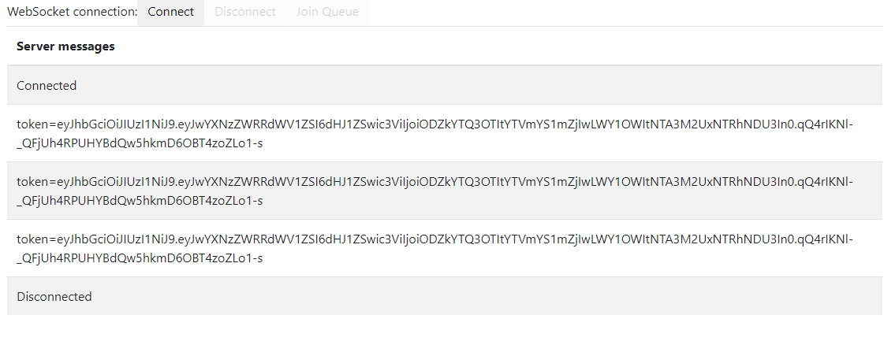

A Virtualized Queue Service with the following features:
- FIFO and Weighted user insertion implementations.  
- Sampled metrics to estimate queue time remaining.
- In-memory queue and (TBD) distributed queue implementations
- Time blocked queue consumption (IE wait until a specific time to begin dequeing).
- A websocket server which listens for enqueue messages and sends notifications when dequeing occurs.

# Future features (IE why websockets?)
- Server updates on position in line and estimated time remaining (using Queue Metrics)
- Client heartbeats to keep positions in line.
- Dequeuing users upon websocket termination.
- Distributed queue implementation using Redis (via VirtualQueue implementation)
- Dynamically updating weighted user strategies.
- Dynamic configuration

# Weighted User versus Regular users
Weighted user logic is useful in the case a user disconnects and reconnects; although users will "lose" their original place in line, a weighted user may be inserted higher when they rejoin.  The user weighting versus time of insertion formula is
currently set to 30/70.

The default out of the box configuration for this code is to use non-weighted users who are inserted purely in a FIFO manner.

# Metrics
Metrics are currently stored in an in-memory fixed-size stack which defaults to 5 minutes of metrics.  A thread samples queue/dequeue rates every 5 seconds to calculate the estimated wait time per user in the queue.  It's 
possible the dequeue rate is lower than the queue rate; in this case lag is calculated and the estimated wait time per user becomes the sample rate.

# Web Demo
To start the Virtual Queue service, execute
`mvn spring-boot:run`

By default, the service starts on port 8081.

Navigate to /src/main/resources/VirtualQueue.html.  
- Click 'connect' to connect to the server.
- Click 'Join Queue' to send an enqueue request; requests are uniquely identified via the session id created on connection.
- After dequeuing, a JWT Token is returned; this sample token would be used for future requests to validate that the user had gone through the virtual queue.
- Click 'disconnect' to end socket connection.

  

# Dependencies
Running / starting this project requires:
- Java 21 + (Virtual Threads are utilized in this project)
- Maven
